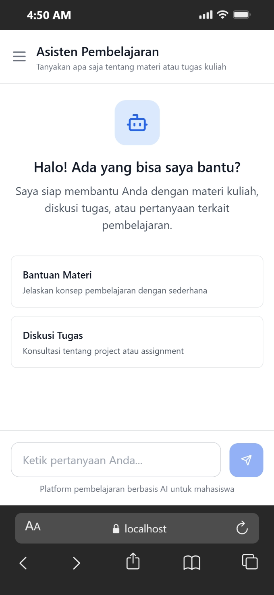

# 🎓 Student Assistant - AI Learning Platform

[](https://opensource.org/licenses/MIT)
[](https://laravel.com)
[](https://reactjs.org)
[](https://www.php.net)

**Platform Pembelajaran Berbasis AI untuk Mahasiswa**

Student Assistant adalah platform pembelajaran interaktif yang memanfaatkan Google Gemini AI untuk membantu mahasiswa dalam memahami materi kuliah, berdiskusi tentang tugas, dan meningkatkan efektivitas belajar. Dibangun dengan arsitektur decoupled modern menggunakan React.js dan Laravel 11.

---

## 🌐 Live Demo

> **🚀 Try it now:** [https://student-assistant-demo.vercel.app](https://student-assistant-demo.vercel.app)

### Demo Credentials

| Role | Email | Password |
|------|-------|----------|
| **Admin** | admin@example.com | password123 |
| **User** | user@example.com | password123 |

> **Note:** Demo menggunakan shared environment. Data dapat di-reset setiap hari.

### Quick Start (Local)

```bash
# Clone repository
git clone https://github.com/RizaAlraihany/student-assistant.git
cd student-assistant

# Backend setup
cd backend
composer install
cp .env.example .env
php artisan key:generate
php artisan migrate --seed
php artisan serve

# Frontend setup (new terminal)
cd frontend
npm install
npm run dev

# Access at http://localhost:5173
```

---

## 📋 Daftar Isi

- [Fitur Utama](#-fitur-utama)
- [Screenshots](#-screenshots)
- [Tech Stack](#-tech-stack)
- [Arsitektur Sistem](#-arsitektur-sistem)
- [Struktur Database](#-struktur-database)
- [Instalasi](#-instalasi)
- [Konfigurasi](#-konfigurasi)
- [Menjalankan Aplikasi](#-menjalankan-aplikasi)
- [API Documentation](#-api-documentation)
- [Keamanan](#-keamanan)
- [Testing](#-testing)
- [Deployment](#-deployment)
- [Troubleshooting](#-troubleshooting)
- [Contributing](#-contributing)
- [License](#-license)

---

## ✨ Fitur Utama

### 💬 Smart Chat Interface
- **Antarmuka Clean & Modern** - Desain minimalis dengan white theme dan blue accent
- **Real-time Messaging** - Pengiriman dan penerimaan pesan secara langsung
- **Markdown Support** - Response AI dengan formatting lengkap:
  - Headings (H1, H2, H3)
  - Bold, Italic, dan kombinasi
  - Ordered & Unordered Lists
  - Inline code dan code blocks
  - Paragraphs dengan spacing yang proper
- **Typing Indicator** - Animasi mengetik yang natural
- **Auto-scroll** - Otomatis scroll ke pesan terbaru
- **Empty State** - Suggestion cards untuk memulai percakapan
- **Chat History** - Riwayat percakapan dengan timestamp

### 🧠 AI Integration & Context Memory
- **Google Gemini API** - Integrasi dengan Gemini 2.5 Flash
- **Contextual Understanding** - AI mengingat 10 pesan terakhir
- **Follow-up Questions** - Mampu memahami pertanyaan lanjutan
- **Smart Responses** - Jawaban terstruktur dan informatif
- **Dynamic Configuration** - Real-time update tanpa restart server

### 🎨 User Experience
- **Sidebar Navigation** - Menu akses cepat ke berbagai fitur (Dashboard, Materi, Tugas, Diskusi)
- **User Profile** - Avatar dengan initial dan info user
- **Suggestion Prompts** - Quick action untuk memulai chat
- **Error Handling** - Error messages yang jelas dan actionable
- **Loading States** - Visual feedback untuk semua async operations

### ⚙️ Admin Dashboard
- **AI Persona Management** - Kustomisasi karakteristik AI
- **System Instruction** - Define AI behavior dan tone
- **Temperature Control** - Slider untuk kreativitas (0.0 - 2.0)
- **Token Limit** - Batasi panjang response (1 - 8192)
- **Model Selection** - Pilih model Gemini yang tersedia

### 🔐 Authentication & Security
- **Secure Registration** - Validasi email dan password strength
- **Laravel Sanctum** - Token-based authentication
- **Role-Based Access** - Admin vs User permissions
- **Password Hashing** - Bcrypt dengan cost factor 12
- **CSRF Protection** - Untuk web routes
- **XSS Prevention** - Auto-escaping output

### 📱 Responsive Design
- **Mobile-First** - Optimal di semua ukuran layar
- **Touch-Friendly** - Minimum tap target 44x44px
- **Collapsible Sidebar** - Slide-in navigation di mobile
- **Overlay Backdrop** - Visual feedback saat sidebar aktif

---

## 📸 Screenshots

### Desktop View

#### Landing Page

*Platform pembelajaran dengan hero section dan highlight fitur utama*

#### Chat Interface

*Interface chat dengan sidebar navigasi, markdown rendering, dan suggestion prompts*

#### Admin Dashboard

*Dashboard admin untuk konfigurasi AI persona dan parameter*

---

### Mobile View

<div align="center">
  <table>
    <tr>
      <td align="center" width="33%">
        
        <br>
        <strong>Landing Page</strong>
        <br>
        <em>Hero section responsive</em>
      </td>
      <td align="center" width="33%">
        
        <br>
        <strong>Chat Interface</strong>
        <br>
        <em>Collapsible sidebar & chat</em>
      </td>
      <td align="center" width="33%">
        
        <br>
        <strong>Admin Dashboard</strong>
        <br>
        <em>Mobile-optimized controls</em>
      </td>
    </tr>
  </table>
</div>

*Tampilan mobile dengan collapsible sidebar, touch-friendly interface, dan responsive layout*

---

## 🛠 Tech Stack

### Frontend

| Technology | Version | Purpose | Documentation |
|------------|---------|---------|---------------|
| **React.js** | 18.3.1 | UI Framework | [Docs](https://react.dev) |
| **Vite** | 5.4.2 | Build Tool & Dev Server | [Docs](https://vitejs.dev) |
| **Axios** | 1.7.7 | HTTP Client | [Docs](https://axios-http.com) |
| **React Markdown** | 9.0.1 | Markdown Rendering | [Docs](https://github.com/remarkjs/react-markdown) |
| **Tailwind CSS** | 3.4.1 | Utility-First CSS | [Docs](https://tailwindcss.com) |
| **Lucide React** | 0.456.0 | Icon Library | [Docs](https://lucide.dev) |

### Backend

| Technology | Version | Purpose | Documentation |
|------------|---------|---------|---------------|
| **Laravel** | 11.x | API Framework | [Docs](https://laravel.com/docs/11.x) |
| **PHP** | 8.2+ | Programming Language | [Docs](https://www.php.net/docs.php) |
| **MySQL** | 8.0+ | Relational Database | [Docs](https://dev.mysql.com/doc/) |
| **Laravel Sanctum** | 4.x | API Authentication | [Docs](https://laravel.com/docs/11.x/sanctum) |
| **Eloquent ORM** | Built-in | Database ORM | [Docs](https://laravel.com/docs/11.x/eloquent) |

### External Services

| Service | Purpose | Documentation |
|---------|---------|---------------|
| **Google Gemini API** | AI Text Generation | [Docs](https://ai.google.dev/docs) |

---

## 🏗 Arsitektur Sistem

### High-Level Architecture

```
┌─────────────────────────────────────────────────────────────────┐
│                         Client Layer                             │
│  ┌──────────────────────────────────────────────────────────┐   │
│  │  React.js (Vite) - http://localhost:5173                 │   │
│  │  • Components (Landing, Auth, Chat, Admin)               │   │
│  │  • State Management (useState, useEffect)                │   │
│  │  • Axios HTTP Client                                     │   │
│  │  • Tailwind CSS Styling                                  │   │
│  └──────────────────────────────────────────────────────────┘   │
└─────────────────────────────────────────────────────────────────┘
                              ↓ HTTP (REST API)
┌─────────────────────────────────────────────────────────────────┐
│                      Application Layer                           │
│  ┌──────────────────────────────────────────────────────────┐   │
│  │  Laravel 11 API - http://localhost:8000/api              │   │
│  │  • Controllers (Auth, Chat, Admin)                       │   │
│  │  • Middleware (Auth, Admin, CORS)                        │   │
│  │  • Services (GeminiService)                              │   │
│  │  • Routes (api.php)                                      │   │
│  └──────────────────────────────────────────────────────────┘   │
└─────────────────────────────────────────────────────────────────┘
                              ↓
┌─────────────────────────────────────────────────────────────────┐
│                         Data Layer                               │
│  ┌──────────────────────────────────────────────────────────┐   │
│  │  MySQL Database                                           │   │
│  │  • users                                                  │   │
│  │  • conversations                                          │   │
│  │  • messages                                               │   │
│  │  • ai_settings                                            │   │
│  │  • personal_access_tokens                                │   │
│  └──────────────────────────────────────────────────────────┘   │
└─────────────────────────────────────────────────────────────────┘

                              ↓ HTTPS (REST API)
┌─────────────────────────────────────────────────────────────────┐
│                      External Services                           │
│  ┌──────────────────────────────────────────────────────────┐   │
│  │  Google Gemini API                                        │   │
│  │  • Model: gemini-2.5-flash                               │   │
│  │  • Endpoint: generativelanguage.googleapis.com          │   │
│  └──────────────────────────────────────────────────────────┘   │
└─────────────────────────────────────────────────────────────────┘
```

### Request Flow

1. **User Action** → React component triggers event
2. **HTTP Request** → Axios sends request with Bearer token
3. **Middleware** → Laravel validates token (Sanctum)
4. **Controller** → Processes request, calls service
5. **Service** → GeminiService formats and sends to Gemini API
6. **Database** → Saves user message and AI response
7. **Response** → JSON data returned to frontend
8. **UI Update** → React updates state and re-renders

---

## 📁 Struktur Project

```
student-assistant/
│
├── frontend/                           # React Application
│   ├── public/
│   │   └── vite.svg                   # App icon
│   │
│   ├── src/
│   │   ├── App.jsx                    # Main app component & routing
│   │   ├── main.jsx                   # Entry point
│   │   ├── index.css                  # Global styles & Tailwind
│   │   │
│   │   └── assets/                    # Static assets
│   │
│   ├── .gitignore
│   ├── package.json                   # Dependencies & scripts
│   ├── vite.config.js                 # Vite configuration
│   ├── tailwind.config.js             # Tailwind configuration
│   ├── postcss.config.js              # PostCSS configuration
│   ├── eslint.config.js               # ESLint rules
│   └── README.md
│
├── backend/                            # Laravel Application
│   ├── app/
│   │   ├── Http/
│   │   │   ├── Controllers/
│   │   │   │   ├── AuthController.php        # Registration, Login, Logout
│   │   │   │   ├── ChatController.php        # Chat & Conversations
│   │   │   │   └── AdminController.php       # AI Settings Management
│   │   │   │
│   │   │   ├── Middleware/
│   │   │   │   ├── AdminMiddleware.php       # Admin-only access
│   │   │   │   └── VerifyCsrfToken.php       # CSRF exclusions
│   │   │   │
│   │   │   └── Kernel.php                    # Middleware registration
│   │   │
│   │   ├── Models/
│   │   │   ├── User.php                      # User model with roles
│   │   │   ├── Conversation.php              # Conversation model
│   │   │   ├── Message.php                   # Message model
│   │   │   └── AiSetting.php                 # AI configuration
│   │   │
│   │   └── Services/
│   │       └── GeminiService.php             # Gemini API integration
│   │
│   ├── bootstrap/
│   │   └── app.php                           # Application bootstrap
│   │
│   ├── config/
│   │   ├── app.php                           # App configuration
│   │   ├── cors.php                          # CORS settings
│   │   ├── database.php                      # Database config
│   │   └── sanctum.php                       # Sanctum settings
│   │
│   ├── database/
│   │   ├── migrations/
│   │   │   ├── 0001_01_01_000000_create_users_table.php
│   │   │   ├── 0001_01_01_000001_create_cache_table.php
│   │   │   ├── 2019_12_14_000001_create_personal_access_tokens_table.php
│   │   │   ├── 2024_01_01_000001_create_ai_settings_table.php
│   │   │   ├── 2024_01_02_000001_create_conversations_table.php
│   │   │   └── 2024_01_03_000001_create_messages_table.php
│   │   │
│   │   └── seeders/
│   │       └── DatabaseSeeder.php            # Default users & settings
│   │
│   ├── routes/
│   │   ├── api.php                           # API routes
│   │   ├── web.php                           # Web routes
│   │   └── console.php                       # Console commands
│   │
│   ├── storage/
│   │   ├── app/
│   │   ├── framework/
│   │   └── logs/                             # Application logs
│   │
│   ├── .env.example                          # Environment template
│   ├── .gitignore
│   ├── artisan                               # Laravel CLI
│   ├── composer.json                         # PHP dependencies
│   └── README.md
│
├── screenshots/                        # Application screenshots
│   ├── landing.png
│   ├── chat.png
│   ├── admin.png
│   ├── mobileLanding.png
│   ├── mobile.png
│   └── mobileAdmin.png
│
└── README.md                           # This file
```

---

## 🗄 Struktur Database

### Entity Relationship Diagram

```
┌─────────────────────┐
│       users         │
├─────────────────────┤
│ id (PK)             │
│ name                │
│ email (UNIQUE)      │
│ password            │
│ role (ENUM)         │
│ created_at          │
│ updated_at          │
└─────────────────────┘
         │ 1
         │
         │ N
         ↓
┌─────────────────────┐
│   conversations     │
├─────────────────────┤
│ id (PK)             │
│ user_id (FK)        │───┐
│ title               │   │
│ created_at          │   │
│ updated_at          │   │
└─────────────────────┘   │
         │ 1              │
         │                │
         │ N              │
         ↓                │
┌─────────────────────┐   │
│      messages       │   │
├─────────────────────┤   │
│ id (PK)             │   │
│ conversation_id(FK) │───┘
│ role (ENUM)         │
│ content (TEXT)      │
│ created_at          │
│ updated_at          │
└─────────────────────┘

┌─────────────────────┐
│    ai_settings      │ (Singleton)
├─────────────────────┤
│ id (PK)             │
│ system_instruction  │
│ model_name          │
│ temperature         │
│ max_tokens          │
│ created_at          │
│ updated_at          │
└─────────────────────┘
```

### Table Schemas

#### 1. users
```sql
CREATE TABLE `users` (
  `id` BIGINT UNSIGNED NOT NULL AUTO_INCREMENT PRIMARY KEY,
  `name` VARCHAR(255) NOT NULL,
  `email` VARCHAR(255) NOT NULL UNIQUE,
  `email_verified_at` TIMESTAMP NULL,
  `password` VARCHAR(255) NOT NULL,
  `role` ENUM('admin', 'user') NOT NULL DEFAULT 'user',
  `remember_token` VARCHAR(100) NULL,
  `created_at` TIMESTAMP NULL,
  `updated_at` TIMESTAMP NULL,
  INDEX `users_email_index` (`email`),
  INDEX `users_role_index` (`role`)
) ENGINE=InnoDB DEFAULT CHARSET=utf8mb4 COLLATE=utf8mb4_unicode_ci;
```

#### 2. conversations
```sql
CREATE TABLE `conversations` (
  `id` BIGINT UNSIGNED NOT NULL AUTO_INCREMENT PRIMARY KEY,
  `user_id` BIGINT UNSIGNED NOT NULL,
  `title` VARCHAR(255) NULL,
  `created_at` TIMESTAMP NULL,
  `updated_at` TIMESTAMP NULL,
  FOREIGN KEY (`user_id`) REFERENCES `users`(`id`) ON DELETE CASCADE,
  INDEX `conversations_user_id_index` (`user_id`)
) ENGINE=InnoDB DEFAULT CHARSET=utf8mb4 COLLATE=utf8mb4_unicode_ci;
```

#### 3. messages
```sql
CREATE TABLE `messages` (
  `id` BIGINT UNSIGNED NOT NULL AUTO_INCREMENT PRIMARY KEY,
  `conversation_id` BIGINT UNSIGNED NOT NULL,
  `role` ENUM('user', 'model', 'assistant') NOT NULL,
  `content` TEXT NOT NULL,
  `created_at` TIMESTAMP NULL,
  `updated_at` TIMESTAMP NULL,
  FOREIGN KEY (`conversation_id`) REFERENCES `conversations`(`id`) ON DELETE CASCADE,
  INDEX `messages_conversation_id_index` (`conversation_id`),
  INDEX `messages_role_index` (`role`)
) ENGINE=InnoDB DEFAULT CHARSET=utf8mb4 COLLATE=utf8mb4_unicode_ci;
```

#### 4. ai_settings (Singleton)
```sql
CREATE TABLE `ai_settings` (
  `id` BIGINT UNSIGNED NOT NULL AUTO_INCREMENT PRIMARY KEY,
  `system_instruction` TEXT NULL,
  `model_name` VARCHAR(100) NOT NULL DEFAULT 'gemini-2.5-flash',
  `temperature` DECIMAL(3,2) NOT NULL DEFAULT 0.70,
  `max_tokens` INT NOT NULL DEFAULT 2048,
  `created_at` TIMESTAMP NULL,
  `updated_at` TIMESTAMP NULL
) ENGINE=InnoDB DEFAULT CHARSET=utf8mb4 COLLATE=utf8mb4_unicode_ci;
```

---

## 📥 Instalasi

### Prerequisites

Pastikan sistem Anda sudah terinstall:

#### Required Software
- **PHP** >= 8.2 ([Download](https://www.php.net/downloads))
- **Composer** >= 2.5 ([Download](https://getcomposer.org/download/))
- **Node.js** >= 18.x ([Download](https://nodejs.org/))
- **MySQL** >= 8.0 ([Download](https://dev.mysql.com/downloads/))
- **Git** ([Download](https://git-scm.com/downloads))

#### PHP Extensions (Required)
```bash
# Check installed extensions
php -m

# Required extensions:
- OpenSSL
- PDO
- Mbstring
- Tokenizer
- XML
- Ctype
- JSON
- BCMath
- Fileinfo
```

### Step 1: Clone Repository

```bash
git clone https://github.com/RizaAlraihany/student-assistant.git
cd student-assistant
```

### Step 2: Backend Setup (Laravel)

```bash
cd backend

# Install PHP dependencies
composer install

# Copy environment file
cp .env.example .env

# Generate application key
php artisan key:generate

# Create database
mysql -u root -p
CREATE DATABASE student_assistant CHARACTER SET utf8mb4 COLLATE utf8mb4_unicode_ci;
EXIT;

# Run migrations and seeders
php artisan migrate:fresh --seed

# Clear caches
php artisan optimize:clear
```

### Step 3: Frontend Setup (React)

```bash
cd ../frontend

# Install Node dependencies
npm install

# Install specific dependencies (if needed)
npm install react-markdown
```

### Step 4: Verify Installation

```bash
# Check backend
cd backend
php artisan --version
# Should show: Laravel Framework 11.x.x

# Check frontend
cd ../frontend
npm --version
# Should show: 10.x.x or higher
```

---

## ⚙️ Konfigurasi

### Backend Configuration

Edit `backend/.env`:

```env
# Application
APP_NAME="Student Assistant"
APP_ENV=local
APP_KEY=base64:xxxxxxxxxxxxxxxxxxxxxxxxxxxxxxxxxxxxx
APP_DEBUG=true
APP_URL=http://localhost:8000
APP_TIMEZONE=UTC
APP_LOCALE=en

# Database
DB_CONNECTION=mysql
DB_HOST=127.0.0.1
DB_PORT=3306
DB_DATABASE=student_assistant
DB_USERNAME=root
DB_PASSWORD=your_password_here

# Google Gemini API
GEMINI_API_KEY=your_gemini_api_key_here
GEMINI_MODEL=gemini-2.5-flash
GEMINI_TEMPERATURE=0.7
GEMINI_MAX_TOKENS=2048
GEMINI_SYSTEM_INSTRUCTION="You are a helpful AI assistant for students. Explain concepts clearly and provide practical examples."

# CORS
FRONTEND_URL=http://localhost:5173

# Session & Cache
SESSION_DRIVER=file
SESSION_LIFETIME=120
CACHE_DRIVER=file
QUEUE_CONNECTION=sync

# Sanctum
SANCTUM_STATEFUL_DOMAINS=localhost:5173
SESSION_DOMAIN=localhost
```

### Mendapatkan Gemini API Key

1. Kunjungi [Google AI Studio](https://makersuite.google.com/app/apikey)
2. Sign in dengan Google Account
3. Click **"Create API Key"**
4. Copy API key yang generated
5. Paste ke `.env` file di `GEMINI_API_KEY`

**Note:** API Key gratis dengan quota:
- 60 requests per minute
- 1,500 requests per day
- 1 million tokens per day

---

## 🚀 Menjalankan Aplikasi

### Development Mode

#### 1. Start Backend Server

```bash
cd backend
php artisan serve

# Output:
# INFO  Server running on [http://127.0.0.1:8000]
```

**Backend akan berjalan di:** http://localhost:8000

#### 2. Start Frontend Development Server

```bash
# Buka terminal baru
cd frontend
npm run dev

# Output:
# VITE v5.4.2  ready in 300 ms
# ➜  Local:   http://localhost:5173/
```

**Frontend akan berjalan di:** http://localhost:5173

### Access Application

- **Frontend**: http://localhost:5173
- **Backend API**: http://localhost:8000/api
- **API Info**: http://localhost:8000

---

## 📡 API Documentation

### Base URL
```
http://localhost:8000/api
```

### Authentication

All protected endpoints require Bearer token in header:
```
Authorization: Bearer {access_token}
```

---

### Public Endpoints

#### 1. Register New User

**Endpoint:** `POST /api/register`

**Request Body:**
```json
{
  "name": "John Doe",
  "email": "john@example.com",
  "password": "password123",
  "password_confirmation": "password123"
}
```

**Success Response: 201 Created**
```json
{
  "access_token": "1|aBcDeFgHiJkLmNoPqRsTuVwXyZ1234567890",
  "token_type": "Bearer",
  "user": {
    "id": 3,
    "name": "John Doe",
    "email": "john@example.com",
    "role": "user",
    "created_at": "2026-02-17T10:00:00.000000Z"
  }
}
```

---

#### 2. Login

**Endpoint:** `POST /api/login`

**Request Body:**
```json
{
  "email": "john@example.com",
  "password": "password123"
}
```

**Success Response: 200 OK**
```json
{
  "access_token": "2|aBcDeFgHiJkLmNoPqRsTuVwXyZ1234567890",
  "token_type": "Bearer",
  "user": {
    "id": 3,
    "name": "John Doe",
    "email": "john@example.com",
    "role": "user"
  }
}
```

---

### Protected Endpoints

#### 3. Get Conversations

**Endpoint:** `GET /api/conversations`

**Headers:**
```
Authorization: Bearer {token}
```

**Success Response: 200 OK**
```json
[
  {
    "id": 1,
    "user_id": 3,
    "title": "Jelaskan konsep Neural Network...",
    "created_at": "2026-02-17T10:30:00.000000Z",
    "messages": [...]
  }
]
```

---

#### 4. Send Message

**Endpoint:** `POST /api/chat`

**Request Body:**
```json
{
  "message": "Apa itu Deep Learning?",
  "conversation_id": null
}
```

**Success Response: 200 OK**
```json
{
  "conversation_id": 1,
  "user_message": "Apa itu Deep Learning?",
  "ai_response": "**Deep Learning** adalah..."
}
```

---

## 🔐 Keamanan

### Security Features

- ✅ **Token-based Authentication** (Laravel Sanctum)
- ✅ **Password Hashing** (Bcrypt)
- ✅ **Role-based Authorization**
- ✅ **CORS Protection**
- ✅ **Input Validation**
- ✅ **SQL Injection Prevention** (Eloquent ORM)
- ✅ **XSS Prevention**
- ✅ **CSRF Protection**

---

## 🚢 Deployment

### Production Deployment

#### Option 1: Vercel (Frontend) + Railway (Backend)

**Frontend:**
```bash
# Build
npm run build

# Deploy to Vercel
vercel --prod
```

**Backend:**
```bash
# Deploy to Railway
railway up
```

#### Option 2: VPS (Full Stack)

```bash
# Setup Nginx for Laravel
sudo nano /etc/nginx/sites-available/student-assistant

# Configure domain and SSL
sudo certbot --nginx -d yourdomain.com
```

---

## 🐛 Troubleshooting

### Common Issues

#### CORS Errors
```bash
# Solution
php artisan config:clear
# Check backend/config/cors.php
```

#### Database Connection
```bash
# Solution
# Check .env credentials
mysql -u root -p
CREATE DATABASE student_assistant;
```

#### Gemini API Errors
```bash
# Solution
# Verify GEMINI_API_KEY in .env
# Check model name: gemini-2.5-flash
```

---

## 🤝 Contributing

Contributions are welcome! Please follow these steps:

1. Fork the repository
2. Create feature branch (`git checkout -b feature/AmazingFeature`)
3. Commit changes (`git commit -m 'Add some AmazingFeature'`)
4. Push to branch (`git push origin feature/AmazingFeature`)
5. Open Pull Request

---

## 📄 License

This project is licensed under the **MIT License**.

```
Copyright (c) 2026 Riza Alraihany

Permission is hereby granted, free of charge, to any person obtaining a copy
of this software and associated documentation files (the "Software"), to deal
in the Software without restriction, including without limitation the rights
to use, copy, modify, merge, publish, distribute, sublicense, and/or sell
copies of the Software, and to permit persons to whom the Software is
furnished to do so, subject to the following conditions:

The above copyright notice and this permission notice shall be included in all
copies or substantial portions of the Software.

THE SOFTWARE IS PROVIDED "AS IS", WITHOUT WARRANTY OF ANY KIND, EXPRESS OR
IMPLIED, INCLUDING BUT NOT LIMITED TO THE WARRANTIES OF MERCHANTABILITY,
FITNESS FOR A PARTICULAR PURPOSE AND NONINFRINGEMENT. IN NO EVENT SHALL THE
AUTHORS OR COPYRIGHT HOLDERS BE LIABLE FOR ANY CLAIM, DAMAGES OR OTHER
LIABILITY, WHETHER IN AN ACTION OF CONTRACT, TORT OR OTHERWISE, ARISING FROM,
OUT OF OR IN CONNECTION WITH THE SOFTWARE OR THE USE OR OTHER DEALINGS IN THE
SOFTWARE.
```

---

## 👨‍💻 Developer

**Riza Alraihany**

- GitHub: [@RizaAlraihany](https://github.com/RizaAlraihany)
- Email: azieralraihany@gmail.com
- LinkedIn: [Riza Alraihany](https://linkedin.com/in/rizaalraihany)
---

## 🙏 Acknowledgments

- **[Laravel](https://laravel.com)** - PHP framework
- **[React](https://react.dev)** - UI library
- **[Tailwind CSS](https://tailwindcss.com)** - CSS framework
- **[Google Gemini](https://ai.google.dev)** - AI capabilities
- **[Vite](https://vitejs.dev)** - Build tool
- **[Lucide](https://lucide.dev)** - Icons

---

**"Membangun masa depan pembelajaran dengan kecerdasan buatan"** 🎓✨

---

*Last Updated: February 17, 2026*
*Version: 1.0.0*
